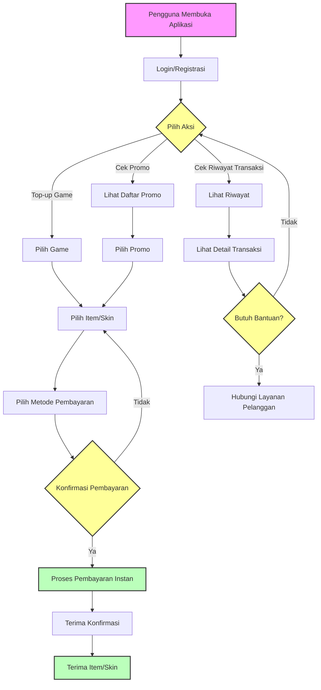

```mermaid
graph TD
    A[Pengguna Membuka Aplikasi] --> B[Login/Registrasi]
    B --> C{Pilih Aksi}
    C -->|Top-up Game| D[Pilih Game]
    C -->|Cek Promo| E[Lihat Daftar Promo]
    C -->|Cek Riwayat Transaksi| F[Lihat Riwayat]
    
    D --> G[Pilih Item/Skin]
    G --> H[Pilih Metode Pembayaran]
    H --> I{Konfirmasi Pembayaran}
    I -->|Ya| J[Proses Pembayaran Instan]
    I -->|Tidak| G
    J --> K[Terima Konfirmasi]
    K --> L[Terima Item/Skin]
    
    E --> M[Pilih Promo]
    M --> G
    
    F --> N[Lihat Detail Transaksi]
    N --> O{Butuh Bantuan?}
    O -->|Ya| P[Hubungi Layanan Pelanggan]
    O -->|Tidak| C
    
    style A fill:#f9f,stroke:#333,stroke-width:2px
    style C fill:#ff9,stroke:#333,stroke-width:2px
    style I fill:#ff9,stroke:#333,stroke-width:2px
    style O fill:#ff9,stroke:#333,stroke-width:2px
    style J fill:#bfb,stroke:#333,stroke-width:2px
    style L fill:#bfb,stroke:#333,stroke-width:2px
```
